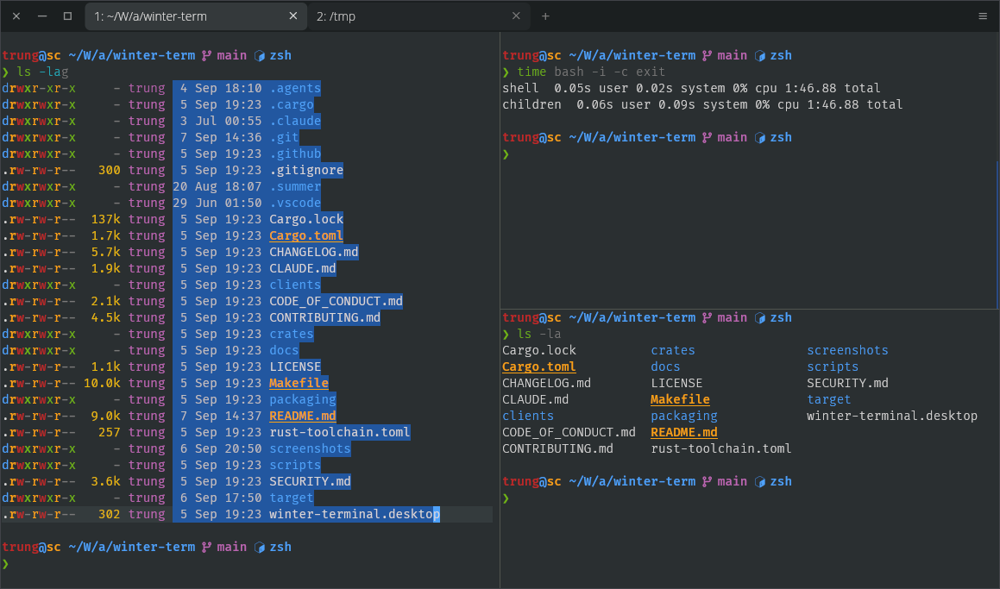

# Winter Term

A modal terminal emulator written in Rust with native-class speed, full Vim editing across any shell or remote session, a built-in multiplexer, and structured command blocks powered by the Terminal Block Protocol.



See the [usage guide](docs/usage-guide.md) for how to drive Winter, and the [protocol specification](docs/terminal-block-protocol-spec.md) for the Terminal Block Protocol (TBP).

## Key features

- **Vim modal editing everywhere:** Normal mode, motions, operators, registers, marks, and text objects live directly inside the terminal layer. They work identically in bash, zsh, fish, Python or Node REPLs, and over remote `ssh` sessions without configuring anything on the remote host.
- **Built-in multiplexer:** Split panes horizontally (`Shift-Alt--`) or vertically (`Shift-Alt-\`), move between them with `Alt-h/j/k/l`, zoom active panes, and cycle tabs with `gt`/`gT`. Panes track independent modes while sharing global Vim registers.
- **Structured command blocks:** OSC 133 shell integration organizes your session into discrete, foldable units with exit codes and durations clearly marked. Jump between blocks with `]b`/`[b`, yank block output with `y`, or target blocks with quick-select (`q`).
- **Rich inline MIME blocks (TBP):** Render tables, interactive Vega charts, LaTeX math, PDFs, and images inline via the Terminal Block Protocol, backed by a real web engine with secure CSP sandboxing and automatic plain-text fallbacks.
- **Prompt-line integration:** Normal-mode operators (`dw`, `ci"`, `x`) act directly on your active shell prompt line, accompanied by which-key hints that display pending keybindings dynamically.

## Core keybindings

A Winter pane is always in one of four modes: **Insert** (owns the PTY), **Normal** (owns the keyboard for navigation and operators), **Visual** (extends selections), or **Block-Focus** (hands input to a rich block's WebView).

| Mode / Area | Keys | Action |
|---|---|---|
| **Modes** | `Esc` | Enter Normal mode (`Esc Esc` if running vim or less) |
| | `i`, `a`, `o` | Return to Insert mode (active shell prompt) |
| | `v`, `V`, `Ctrl-v` | Characterwise, linewise, or blockwise Visual mode |
| | `Enter` | Focus rich WebView block (Block-Focus mode) |
| **Motions** | `h` `j` `k` `l` | Left, down, up, right |
| | `w` `b` `e` / `W` `B` `E` | Word forward, backward, word end |
| | `0` / `^` / `$` | Start of line, first non-blank character, end of line |
| | `gg` / `G` | Jump to first line, last line of scrollback |
| | `Ctrl-u` / `Ctrl-d` | Scroll half page up, half page down |
| **Operators** | `d` `c` `y` | Delete, change, yank (with motion or text object) |
| | `iw`, `i"`, `i(`, `i[` | Inner word, quotes, parentheses, brackets |
| | `p` / `P` | Paste from register (shared across all panes) |
| | `.` | Repeat the last change |
| **Search** | `/` / `?` | Search forward, search backward |
| | `n` / `N` | Next match, previous match |
| **Blocks** | `]b` / `[b` | Next command block, previous command block |
| | `y` | Yank the command block output under the cursor |
| | `q` | Quick-select: overlay labels to target any block |
| **Panes** | `Shift-Alt-\` | Split pane vertically |
| | `Shift-Alt--` | Split pane horizontally |
| | `Alt-h/j/k/l` | Move focus between panes |
| | `Shift-Alt-=` | Zoom or restore focused pane (toggle) |
| | `Ctrl-Shift-q` | Close focused pane |
| **Tabs** | `Ctrl-Shift-t` / `Ctrl-Shift-w` | New tab, close tab |
| | `gt` / `gT` or `Ctrl-Tab` | Next tab, previous tab |
| **Palette** | `Ctrl-Shift-p` or `Alt-x` | Open command palette |

See the [keybinding reference](docs/usage-guide.md#keybinding-reference) in the usage guide for the complete keymap.

## Install

Every release publishes pre-compiled packages and installers to its [GitHub Releases](https://github.com/taquangtrung/winter-term/releases) page.

| Platform | Installation method |
|---|---|
| **Debian/Ubuntu** | Download `.deb` and run `sudo dpkg -i <file>.deb` |
| **Arch Linux** | Install from AUR: `yay -S winter-term` |
| **Windows** | Run setup `.exe`, Scoop, or winget |
| **macOS** | Download `.dmg` and drag `Winter.app` to Applications |

Rust developers can also install via `cargo install winter-term`. Building from source requires Rust 1.96+ and GTK 3 / WebKit2GTK libraries (`libgtk-3-dev`, `libwebkit2gtk-4.1-dev`, `libsoup-3.0-dev`, `libjavascriptcoregtk-4.1-dev`, and `libxdo-dev` on Debian and Ubuntu).

### macOS setup notes

The pre-built `.dmg` is built for Apple silicon (**arm64**); Intel Macs require a source build. Because the binary is not yet notarized, bypass Gatekeeper on first launch via right-click > Open, or run:

```bash
xattr -dr com.apple.quarantine /Applications/Winter.app
```

To expose the `winter` command on your `PATH`:

```bash
sudo ln -sf /Applications/Winter.app/Contents/MacOS/winter /usr/local/bin/winter
```

## Platform support

| Platform | Status | Packaging |
|---|---|---|
| Linux (X11/Wayland) | Primary development target, fully tested | `.deb`, AUR |
| Windows | Supported, tested in CI | Inno Setup `.exe`, Scoop, winget |
| macOS | Builds and tested in CI | `.dmg` (Apple silicon, arm64) |

Flatpak packaging is planned. A sandboxed terminal needs to spawn host shells rather than container shells (`flatpak-spawn --host`), which requires an internal application change.

## Shell integration

Command blocks, exit codes, and directory tracking rely on OSC 133 and OSC 7 marks emitted by your shell. Winter runs without them, but the entire session remains a single rolling buffer. Enable full block functionality by adding one line to your shell configuration:

```bash
# In ~/.bashrc (or winter.zsh in ~/.zshrc, winter.fish in ~/.config/fish/config.fish)
[ -r /usr/share/winter-term/shell-integration/winter.bash ] && \
    . /usr/share/winter-term/shell-integration/winter.bash
```

The script no-ops outside Winter and re-sources safely. If you already use OSC 133 integration from kitty, WezTerm, or iTerm2, Winter recognizes those marks automatically.

Integration scripts are located in `/Applications/Winter.app/Contents/Resources/shell-integration/` on macOS, `<install dir>\shell-integration` on Windows, and `clients/shell-integration/` in a source checkout.

## Configuration

Configuration files use the [KDL](https://kdl.dev/) format and live in `~/.config/winter-term/` (`%APPDATA%\winter-term` on Windows):

- `settings.kdl`: Window appearance, typography, themes, cursor styles, and security tiers.
- `keybindings.kdl`: Custom key chords for window, tab, and pane operations.

Settings reload immediately upon file save without restarting the terminal. You can also trigger a manual reload with `winter --reload`.

## Security model for rich blocks

Any program writing to the PTY can emit a TBP block: a `cat` of an untrusted file, output piped from `curl`, or remote SSH output. Because wire streams carry no caller identity, a block's requested trust tier is treated as an upper bound to restrict, never an automatic grant.

Two deny-by-default settings in `settings.kdl` govern rich blocks:

```kdl
security {
    // Ceiling applied to the tier a block asks for. "restricted" (the default)
    // renders under a CSP with scripting off. Raising this to "trusted" grants
    // scripting to any stream reaching a pane, not just tools you trust.
    block-max-trust "restricted"

    // Allow block content to load subresources over the network (needed for
    // live Vega charts). Off by default to prevent unexpected network calls.
    block-remote-assets #false
}
```

Clipboard reading via OSC 52 is similarly opt-in (`clipboard-read`). See the [usage guide](docs/usage-guide.md) for the complete security and configuration reference.

## Documentation

| Document | Contents |
|---|---|
| [Usage guide](docs/usage-guide.md) | Modes, full keymaps, settings, multiplexer |
| [TBP spec](docs/terminal-block-protocol-spec.md) | TBP v1 protocol framing and tiers |
| [Architecture](docs/architecture.md) | Crate structure and rendering pipeline |
| [Contributing](CONTRIBUTING.md) | Development setup, test suite, PR guidelines |
| [Release guide](docs/releasing.md) | Maintainer runbook for cutting a release |
| [Security policy](SECURITY.md) | Threat model and vulnerability disclosure |

## Contributing

Run `make lint` and `make test` before opening a pull request. See [CONTRIBUTING.md](CONTRIBUTING.md) for development workflows and [CODE_OF_CONDUCT.md](CODE_OF_CONDUCT.md) for community guidelines.

## Security

Report security vulnerabilities privately according to [SECURITY.md](SECURITY.md). All bytes arriving from a PTY are treated as attacker-controlled; crashes and sandbox escapes are treated as security issues.

## License

Winter is licensed under the [MIT License](LICENSE).
